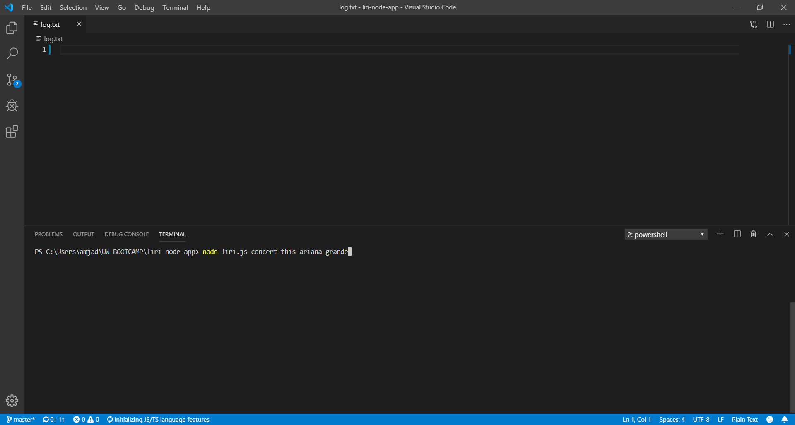
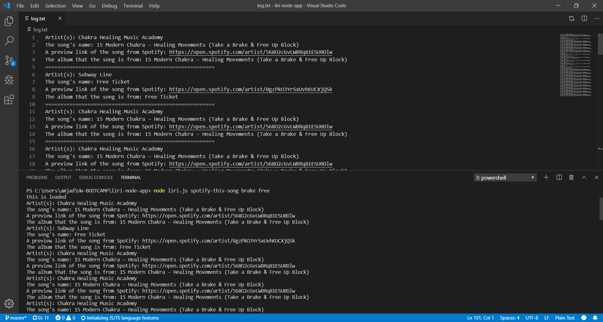
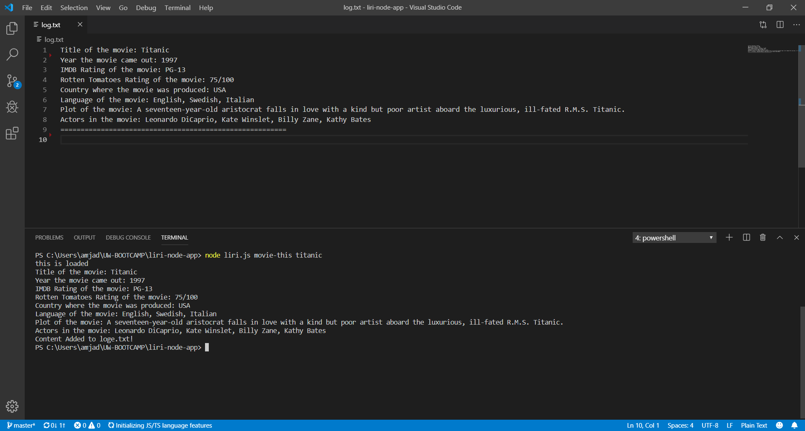
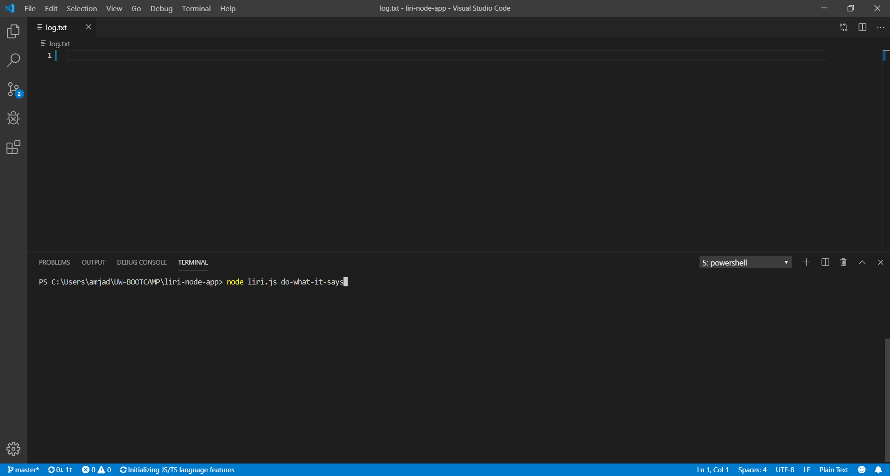
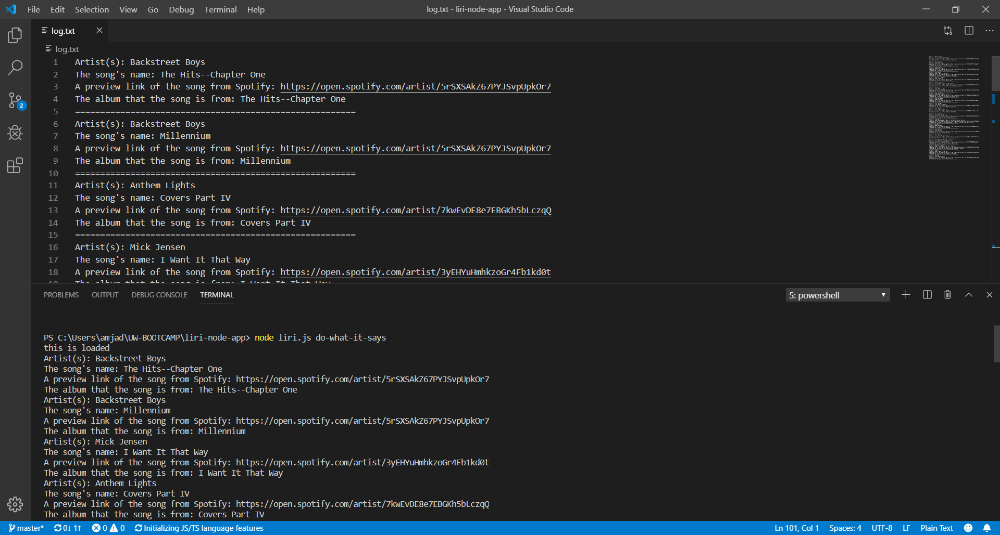

# liri-node-app
LIRI is like iPhone's SIRI. However, while SIRI is a Speech Interpretation and Recognition Interface, LIRI is a _Language_ Interpretation and Recognition Interface. LIRI will be a command line node app that takes in parameters and gives you back data.

## Overview
LIRI will search Spotify for songs, Bands in Town for concerts, and OMDB for movies.
Using the command line users are able to ask LIRI to search. And LIRI will show the results in the terminal and also it will print the results in a text file called "log.txt".
LIRI can understand four commands:
* concert-this "artist's name"
    This will search the Bands in Town Artist Events for an artist and render. The following information about each event will show:
    * Name of the venue
    * Venue location
    * Date of the Event
* movie-this "movie's name"
    This will search the OMDb for a movie, and the following information will show:
    * Title of the movie.
    * Year the movie came out.
    * IMDB Rating of the movie.
    * Rotten Tomatoes Rating of the movie.
    * Country where the movie was produced.
    * Language of the movie.
    * Plot of the movie.
    * Actors in the movie.
* spotify-this-song "song's name"
    This will search spotify for a song the, and 20 related songs will come back as results and the following information about the each song will show:
    * Artist(s)
    * The song's name
    * A preview link of the song from Spotify
    * The album that the song is from
* do-what-it-says
    This will run the "spotify-this-song" command with "I Want it That Way" as the song, and it will show 20 related songs.

## Instructions

#### Step one
"concert-this"
In your terminal type
```terminal
node liri.js concert-this artist's name
```



##### The results look like below


#### Step two
"spotify-this-song"
In your terminal type
```terminal
node liri.js spotify-this-song song's name
```


##### The results look like below



#### Step three
"movie-this"
In your terminal type
```terminal
node liri.js movie-this movie's name
```


##### The results look like below



#### Step four
"do-what-it-says"
In your terminal type
```terminal
node liri.js do-what-it-says
```



##### The results look like below



And after running your code the results will show in the terminal and also at "log.txt" file


## Link
https://github.com/AmjedAyoub/liri-node-app

## Technologies
node.js